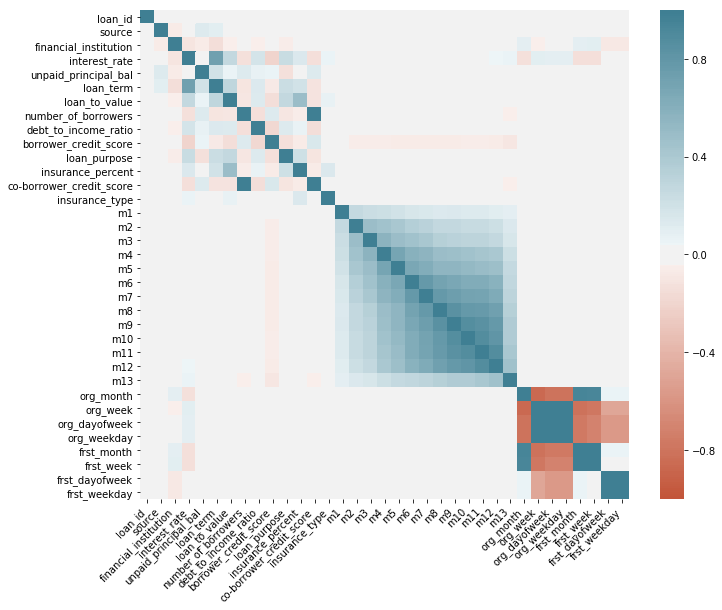
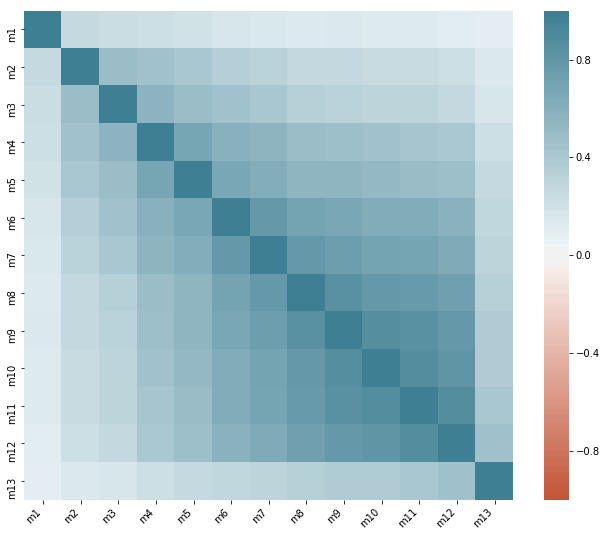
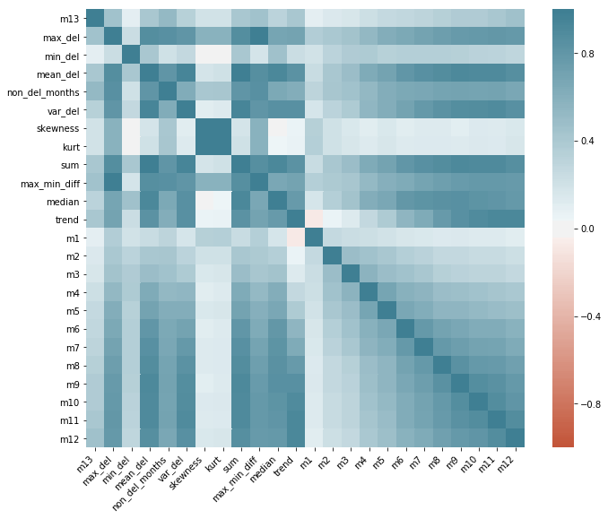

# Loan-Delequency-Prediction
### Dataset Description:
It is a India ML hiring hackathon dataset hosted by analytics vidya which can be seen in the below given link


https://datahack.analyticsvidhya.com/contest/india-ml-hiring-hackathon-2019/

### Problem statement:
1. To predict the delequency in the 13th month of each loan which is missing in the test data
2. Predict as delequent or non-delequent (1, 0)

#### Preprocessing and Feature Engineering:
**Step:1**
1. Converting all categorical columns to numericals :(source, financial_institution,loan_purpose)
2. Converting dates to Date_Time format and extracting
    * Month
    * Week
    * Day of th month
    * Day of the week
**Step-2:**
1. Finding the feature importance in normal Machine learning algorithm (Tree Classifier)
2. Finding the correlated features 

* **Feature importance** - Gives what are the features in the data influence the label (here, 1- delequent, 0- non-delequent)
* **Correlated features** - The features that are correlated to the label are important in classification algorithm (but not in regression algorithm)

As we are in need of finding the delequency of a particual loan , it is a classification problem

**Correlation plot of preprocessed data**


**Correlation plot of only selected features**


**Step:3**
1. Extract the following features from the selected fatures:[m0 to m12]
    * Max delequent of previous months
    * Min delequent of previous months
    * Max min diffetence of previous months - gives how the delequency fluus months
    * Sum of delequent of previous monthsctuates
    * Mean delequent of previous months
    * Variance delequent of previous months
    * Number of delequent months delequent of previo

    * Median of delequent of previous months
    * Skewness of previous months - gives whether the delequency is more in the later or earlier months
    * Kurtosis of previous months -  tailedness - i.e, how the delequency is in recent months
    * Trend of the previous month delequency
    
**Corelation of final train data**


Train data - 69634 data with 23 features each
Validation data - 46424 data with 23 features each
Test data - 35866 data with 23 features each

#### Building the Model- GRU

**GRU - Gated Recurrent Unit**

* Why GRU?
    - The GRU has an advantage of storing the previous sequnce 
    - Overcomes vanishing gradient problem - i.e., The backpropagation will give importance to initial data in sequence as well
    - Works as efficient as LSTM also with less parameters
**Model**:

- The model has a GRU with 32 cells, Dense of 10, and then final Dense for 2 classes
- The model is trained with class weights of ratio 1:7 as the data is imbalanced towards the class 1

**Performance analysis of valid data**

Confusion_matrix:
```
 [[46020   150]
 [  109   145]]
``` 
Accuracy: 0.9944209891435465

F1-score: 0.528233151183971

```
Classification Report:
               precision    recall  f1-score   support

           0       1.00      1.00      1.00     46170
           1       0.49      0.57      0.53       254

   micro avg       0.99      0.99      0.99     46424
   macro avg       0.74      0.78      0.76     46424
weighted avg       0.99      0.99      0.99     46424
```

The result was published in the private leader board of the hackathon competition
## Public board -244/1232  Private board - 149/712 
### The above ranking is among 3740 participants
